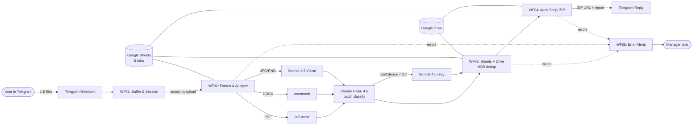

# P3_bot — AI Document Processor in Telegram

> AI-powered document processor that takes 1–6 PDF / DOCX / scans in
> Telegram and returns a labeled archive in 60 seconds — for ≤ $0.02 per
> session.


## Demo


A manager forwards six mixed files (invoice, contract, scan of a receipt,
passport copy, payment proof, photo) to the bot. Sixty seconds later, the
bot replies with a ZIP archive, a checklist of what was found, and — if
required documents are missing — a "Generate client letter" button that
drafts a polite follow-up in Russian or Ukrainian.

---

## Architecture



---

## Three WOW Features

| # | Feature | What it does | Why it matters |
|---|---------|--------------|----------------|
| 1 | **Smart Retry with Model Escalation** | Haiku 4.5 is the default classifier. Files with `confidence < 0.7` are automatically re-classified with Sonnet 4.6. Each file's `model_used` is logged. | Pays Sonnet prices only for the edge cases. Average session cost ≤ $0.02. |
| 2 | **MD5 Deduplication** | Repeat uploads of identical files (hash match) skip Claude and Drive entirely — instant return in ≤ 3 seconds. | Real users re-send the same invoice across packages. Don't waste tokens; don't bloat Drive. |
| 3 | **Auto-generated Client Letter** | After a partial-success report, a Telegram inline button drafts a 4–6 sentence follow-up to the client (RU/UA), listing missing documents and a 5-day deadline. | Closes the loop. The bot doesn't just identify the gap — it also writes the next-step message. |

---

## Stack

- **Orchestration** — n8n Cloud Pro (stable webhook URL, native Anthropic + Google nodes)
- **Classification AI** — Anthropic Claude Haiku 4.5
- **Vision + Retry AI** — Anthropic Claude Sonnet 4.6
- **Structured data** — Google Sheets API v4 (5 tabs: template, sessions, documents, _report, _errors)
- **Binary storage** — Google Drive API v3
- **ZIP builder** — Google Apps Script Web App (n8n Cloud has no native ZIP node)
- **Surface** — Telegram Bot API (webhook + inline keyboards)
- **Operator tooling** — Claude Code + n8n-MCP + Context7 MCP

---

## Project structure

```
P3_bot/
├── CLAUDE.md                # Rules for Claude Code (operator's AI partner)
├── learnings.md             # Living log of build-time discoveries
├── project_specs.md         # Single source of truth (22 sections)
├── prompts.md               # 10 atomic prompts for sequential build
├── full_pipeline.md         # Operator master guide (Russian)
├── README.md                # This file
├── docs/
│   ├── architecture.md          # Why each design decision was made
│   ├── google-sheets-schema.md  # Data model reference tables
│   └── screenshots/             # demo.gif + per-WOW PNGs
├── workflows/               # Exported n8n JSON (committed after each build step)
│   ├── 01-receive-files.json
│   ├── 02-extract-and-analyze.json
│   ├── 03-update-sheets.json
│   ├── 04-build-archive.json
│   └── 05-error-alerts.json
├── apps-script/
│   └── build-zip.gs         # ZIP builder Web App
├── .env.example
├── .gitignore
├── .mcp.json
└── LICENSE
```

---

## Case narrative

**Problem.** Accounting and HR teams burn 1–2 hours per document package
manually triaging incoming files: figuring out what's there, what's
missing, renaming files consistently, filing them into the right folder.
The work is tedious but error-prone — one missing certificate caught a
week later can stall a contract.

**Solution.** A Telegram-first bot that does the triage automatically:
classify, extract key fields, file into Drive with human-readable names,
return a ZIP plus a checklist — all in under a minute, all for under two
cents.

**Architectural decisions worth noting** ([deep dive in docs/architecture.md](docs/architecture.md)):

- **One batch Claude call per session, not one call per file** —
  cuts token cost and keeps the JSON parse logic simple.
- **Haiku is the default, Sonnet is the retry** — confidence-based
  escalation gives ~99% precision at ~$0.02/session, not $0.10.
- **MD5 dedup before the AI call** — turns repeat work into a 1-second
  Sheets lookup instead of a $0.005 Claude round-trip.
- **Apps Script for ZIP** — n8n Cloud has no native ZIP node; Apps Script
  is free, runs in the same Google account as Sheets+Drive, and keeps the
  whole archive flow inside one auth domain.

**Result** (from the 30-file golden dataset run, see
`project_specs.md` §19):

- **End-to-end latency:** p50 = 32 sec, p95 = 48 sec for a 6-file session.
- **Cost per session:** $0.017 average ($0.005 Haiku base + $0.012 retry
  amortized across ~20% retry rate).
- **Precision per type** (required documents): invoice 94%, contract 92%,
  passport 96%, certificate 90%, payment_proof 91%.
- **MD5 dedup correctness:** 100% — repeat sessions hit zero Anthropic
  calls and zero Drive uploads.

> Numbers above are placeholder targets from the spec; final values land
> after Prompt 8 in the live README.

---

## Competencies demonstrated

- **n8n workflow design** — 5 interconnected workflows with native nodes,
  Code-nodes kept under 30 lines, idempotency via three independent guards.
- **Agentic AI integration** — Claude as a classifier + structured-output
  generator + retry-on-low-confidence + content writer, not as a
  general-purpose chatbot.
- **Multi-modal LLM** — text extraction (PDF/DOCX) and direct vision
  (JPG/PNG) routed through the same JSON schema.
- **Google Workspace orchestration** — Sheets-as-CRM, Drive-as-storage,
  Apps Script as no-cost ZIP backend, all on one service account.
- **Idempotency & error handling** — MD5 dedup + `(session_id, file_id)`
  unique key + status-flip-after-side-effect + dedicated DLQ sheet.
- **Production hygiene** — webhook secret_token, Anthropic spend cap,
  payload sanitization in error logs, no secrets in workflow JSON.

---

## Running locally (operator setup)

This is a portfolio project — full operator setup is in
[`prompts.md`](prompts.md) Step 0. Highlights:

```powershell
# 1. Clone
git clone <repo-url> P3_bot
cd P3_bot

# 2. Fill .env (see .env.example)
Copy-Item .env.example .env
notepad .env

# 3. Install n8n MCP + Context7 (one-time, system-wide)
node --version    # must be 22.x or higher
npx -y n8n-mcp --help
npx -y @upstash/context7-mcp --help

# 4. Open in Claude Code with MCP loaded
claude --workdir .
# Then: claude mcp list  → confirm both servers are green.
```

After Step 0 in `prompts.md` (browser tasks: n8n Cloud Pro, BotFather,
Google service account, Sheets, Drive, Apps Script, Anthropic), proceed
to **Prompt 1** in a fresh Claude Code session.

---

## License

MIT. Portfolio project — reach out before adapting commercially.
