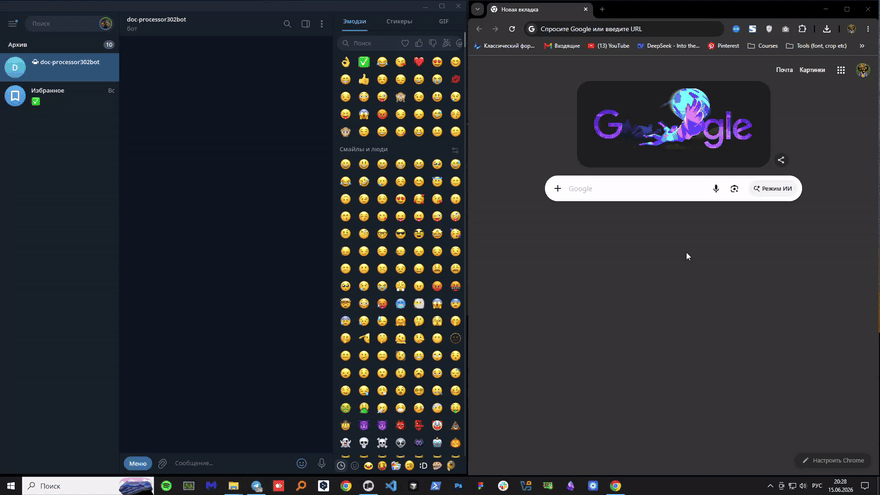

# AI Document Processor
> A Telegram bot that takes one to six mixed PDF/DOCX/scans and returns a renamed, sorted, deduplicated ZIP archive in about a minute — with a follow-up letter drafted if anything is missing.

**Live demo:** [LIVE_DEMO_URL]

## Overview

Accounting and HR teams burn one to two hours per document package manually triaging incoming files: figuring out what's there, what's missing, renaming files consistently, filing them into the right folder. The work is tedious and error-prone — one missing certificate caught a week later can stall a contract. This bot does the triage automatically: classify each file by type, extract key fields, file into Drive with human-readable names, and reply with a ZIP plus a checklist of what's missing — in under a minute, for under two cents per session.

## Key Features

- **Up to six files in one session.** Drop a mix of PDFs, DOCXs, and phone photos of receipts into the same Telegram chat; the bot buffers them, treats them as one package, and processes them together.
- **Per-file classification + per-field extraction.** Each file gets a type label (invoice / contract / passport / certificate / payment_proof / photo) and the structured fields that type carries (invoice number, dates, totals, parties, etc.).
- **Smart model escalation.** Anthropic Haiku 4.5 handles every file by default; only files where the classifier returned `confidence < 0.7` are silently retried by Sonnet 4.6. The per-file `model_used` value is logged.
- **MD5 deduplication.** Identical files (the user re-sending the same invoice across packages) skip the AI call and Drive upload entirely — instant return in ≈3 seconds with the cached result.
- **One-button follow-up letter.** If a required document is missing from the package, the success message includes a "Draft client letter" inline button that produces a four-to-six-sentence follow-up in Russian or Ukrainian with the list of missing documents and a 5-day deadline.
- **Filed into Drive with human-readable names.** Files are renamed `YYYY-MM-DD__<type>__<party>__<original>.<ext>` and dropped into a per-user folder; the bot returns a ZIP of just the files from this session.

## Tech Stack

**Orchestration**
- n8n Cloud Pro (5 workflows: receive → extract → persist → archive → error alerts)
- Stable webhook URL, native Anthropic + Google nodes

**AI**
- Anthropic Claude Haiku 4.5 — default classifier + structured-output extraction
- Anthropic Claude Sonnet 4.6 — vision (photos) + low-confidence retry path

**Front-end + data layer**
- Telegram Bot API (Python `aiogram` 3 in the receiver service)
- FastAPI HTTP callback receiver bridging n8n → Telegram
- Google Sheets API v4 — 5 tabs: template, sessions, documents, _report, _errors
- Google Drive API v3 — file storage with the renaming convention above
- Google Apps Script web app — ZIP builder (n8n Cloud has no native ZIP node)

**Text + binary extraction (inside n8n Code nodes)**
- `pdf-parse` for PDFs with a text layer
- `mammoth` for DOCX
- Claude Sonnet 4.6 Vision for image-only files

## Architecture Highlights

**1. One batch AI call per session, not one call per file.** A six-file package is sent to the classifier as a single message with all six text-extracted bodies inlined and a JSON schema asking for an array of `{file_index, type, confidence, fields}`. This keeps token cost down (shared system prompt is paid once, not six times), keeps the parse logic simple (a single `JSON.parse` instead of six round-trips), and makes retries cheap (a low-confidence escalation re-sends only the files that need it).

**2. Haiku-default, Sonnet-on-low-confidence escalation.** The default model is cheap; the smarter model is the retry path. Each result row carries the `confidence` Haiku produced. If it falls below 0.7, the file (and only that file) is re-classified by Sonnet 4.6. A `model_used` column in the results table makes the routing visible to the operator. Average session cost lands around $0.017 instead of $0.10.

**3. MD5 deduplication before the AI call.** Every uploaded file's MD5 is computed inside the n8n Code node and looked up in a `documents` Sheets tab keyed by hash. A hit short-circuits the entire pipeline: no Anthropic call, no Drive upload, just a "same as session X, here's the cached ZIP link" reply. In testing, repeat sessions hit zero AI calls and finish in under three seconds.

**4. Apps Script for ZIP, not a custom service.** n8n Cloud has no native ZIP node and shelling out to a custom worker would mean managing another runtime + auth path. Google Apps Script runs inside the same Google account that owns the Sheets and Drive, costs nothing, and can `DriveApp.createFile()` a ZIP from a list of file IDs — a 30-line web app, deployed once, called by n8n with an OIDC-signed request.

**5. Three independent error paths into one DLQ.** Workflow 02 (extraction), Workflow 03 (Sheets/Drive persist), and Workflow 04 (ZIP build) each route their failures into Workflow 05 (Error Alerts), which writes to an `_errors` Sheets tab and DMs the operator's manager chat. A single retry button in the manager chat re-fires the session from the failing workflow forward — not from the start — so partial work isn't redone.

## Status

Case study / portfolio project. Pipeline ships behind a webhook secret, with payload sanitization in error logs and no secrets in the workflow JSON exports under `workflows/`.
