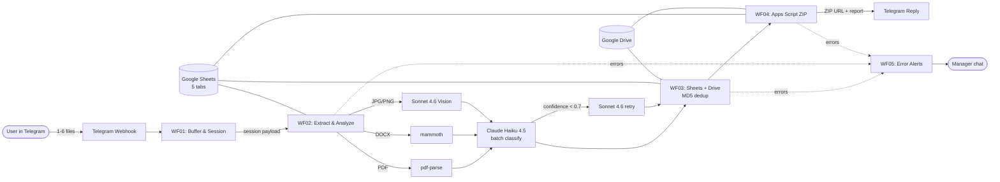

# Architecture — P3_bot

> Why each load-bearing decision was made. Audience: engineers reading
> the repo (not operators). For "how to set up", see `prompts.md` Step 0;
> for "what the spec says", see `project_specs.md`.

---

## 1. System diagram



---

## 2. Why n8n Cloud Pro (and not self-hosted)

The brief proposes self-hosted n8n on Railway free tier. That works for
the build but creates three operational debts that bite a portfolio
demo:

1. **Webhook URL instability.** Railway containers cycle every ~14 days
   or on every redeploy; the public domain changes; Telegram webhook
   silently breaks. Re-pointing it is a 2-minute fix that a portfolio
   reviewer will encounter exactly once — and conclude the system is
   flaky.
2. **Encryption key custody.** `N8N_ENCRYPTION_KEY` is yours to keep. Lose
   it, and every credential in the Postgres DB becomes unreadable
   forever. No recovery path. n8n Cloud Pro handles this for you.
3. **Postgres backup.** Railway Hobby has no automatic snapshots. One
   crash = all execution history lost. Cloud Pro backs Postgres up
   inside their stack.

For $20/month, Cloud Pro removes all three. The trade-off is no `docker
exec` access, no custom Node modules in Code nodes — fine for this build.

When to revisit: a client demanding data residency for GDPR or strict
corporate policy. Then self-hosted is the right call, and the operational
debt is the cost of compliance.

---

## 3. Why Haiku is the default, Sonnet only on retry

Naive options: (a) use Sonnet for everything (accurate but expensive),
(b) use Haiku for everything (cheap but misses edge cases). Both lose.

The model-escalation pattern lets Haiku do ~80% of the work at Haiku
prices, and routes only the genuinely-ambiguous files to Sonnet. The
trigger is `confidence < 0.7` — a threshold tuned against the 30-file
golden dataset.

Per-session economics (verify pricing via Context7 — these are illustrative):

| Path | Cost component | Approx |
|---|---|---|
| Haiku-only baseline | 6 files × ~3000 tokens system+content input + 600 output | ~$0.005 |
| With 20% retry to Sonnet | 1–2 files re-classified at Sonnet's ~5× rate | ~$0.012 extra |
| **Average session** | | **~$0.017** |

The trick that makes this affordable is **prompt caching** on the system
prompt and template list: 90% of the prompt tokens repeat across
sessions, and Anthropic charges 10% for cache hits. Without caching, the
same workflow would cost $0.04+ per session — over budget.

---

## 4. Why a single batch call instead of per-file calls

Per-file Claude calls feel intuitive ("each file is independent, classify
in parallel") but lose on three axes:

- **System prompt overhead.** A 2000-token system + template list
  duplicates per file. For a 6-file session: 12,000 wasted input tokens
  before any content.
- **Cache fragmentation.** Anthropic's ephemeral cache works best on a
  single, stable prompt with a small tail. Per-file calls fragment the
  cache and reduce hit rate.
- **Response parsing.** One JSON response with `files[]` is one parse;
  six parses are six places to fail.

One batch call accepts up to 6 file contents concatenated with `--- FILE
<id> ---` separators. The model returns a single `{files: [...]}` JSON.
Latency stays well under 10 seconds for Haiku on this payload size.

The only place per-file calls re-appear is the retry path (Sonnet sees
only the subset of files where Haiku gave low confidence). This is
intentional — those are exactly the files that benefit from focused
attention.

---

## 5. Idempotency strategy — three independent guards

Document workflows are inherently retry-prone: users re-send packages,
Telegram retries failed webhooks, n8n executions occasionally restart on
infrastructure events. The design assumes any step can fire twice and
still produce a correct outcome.

### 5.1 MD5 dedup at the Sheets layer (`documents.file_md5`)

Before Claude is called in WF03, the file's MD5 hash is computed from
`file_unique_id + "_" + file_size` and looked up in `documents`. If a
prior row exists, the new row links to its `drive_url` and
`detected_type` without a Claude call. This dedup is intentional, not
accidental — it powers WOW 2.

### 5.2 Compound unique key `(session_id, file_id)`

Every write to `documents` uses Sheets `Append or Update` keyed on
`(session_id, file_id)`. If a workflow restarts mid-session, the second
attempt sees the row exists and updates in place instead of duplicating.

### 5.3 Status flip after side-effect commits

`sessions.status` advances through `pending → extracting → classifying →
archiving → done`. Each transition fires only AFTER the prior step's
side effect (Drive upload, Sheets append, Telegram message) returned
2xx. If the bot crashes mid-archive, `status` is still `archiving`, and a
re-run picks up from there cleanly.

---

## 6. Why Apps Script for the ZIP archive

n8n Cloud Pro has no native ZIP node. The options:

| Option | Why we didn't pick it |
|--------|----------------------|
| Code node + `archiver` npm | n8n Cloud sandboxes Code nodes; `archiver` is not in the allowed module list. |
| External Lambda / Cloud Function | Adds a third service, another set of credentials, another monitoring surface. |
| **Google Apps Script Web App** | Native to the same Google account as Sheets+Drive. Free quota is generous. `Utilities.zip()` is one line of code. |

The trade-off is Apps Script's quirky HTTP layer (200 OK with `error`
field instead of real error codes; `Anyone` deploy URLs are unguessable
but not secret). We mitigate the second with a shared query-param token
(`?token=$APPS_SCRIPT_TOKEN`) checked in `doPost(e)`.

---

## 7. AI as enhancement, not single point of failure

When Anthropic API has a partial outage (it does, occasionally — 99.5%
not 99.99%), the bot's response is graceful:

- WF02 retry logic gives Anthropic ~30 seconds before giving up.
- On give-up: workflow exits with `_errors` log + Telegram message to the
  user ("обработка временно недоступна, попробуй через несколько минут").
- The session row stays in `pending` — a future bot restart can reprocess
  by reading pending sessions.
- The user's files are NOT lost — they're still downloadable from
  Telegram for 24 hours via `getFile`.

AI being down is an inconvenience, not a data-loss event.

---

## 8. Error handling chain

```
[Workflow] → [Code-node try/catch] → [Error Trigger] → [WF05]
                                                          │
                                                          ├── Sheets _errors append
                                                          ├── Telegram alert to MANAGER_CHAT_ID
                                                          └── (if WF04 was source) Telegram graceful msg to user
```

**Sanitization rules** (enforced in WF05 sanitize_payload Code node):
- Base64 strings → `<base64 N bytes>`
- JWT-shaped strings → `<token>`
- URLs with query strings → host only
- Truncate to 500 chars

This ensures `_errors` is auditable (managers can inspect) but never
leaks secrets.

---

## 9. Git as disaster recovery

Five workflow JSONs live in `workflows/` and are committed after each
prompt's success. If a workflow gets corrupted (operator accidentally
edits in n8n UI and saves bad state), `git checkout workflows/<file>` +
`n8n_create_workflow` from the JSON restores the last known good state.

Credentials are NOT in git (operator-side `.env` and n8n Credential
Vault). The recovery procedure for credential loss is documented in
`prompts.md` Step 0 — recreating them is a 30-minute task, not a data
loss.

Apps Script source is in `apps-script/build-zip.gs` and committed.

---

## 10. Trade-offs and limitations

v1 explicitly does not support:

- **Excel / XLSX content extraction.** mammoth doesn't handle XLSX; we'd
  need a separate node (`xlsx-populate` or similar). Out of scope.
- **Handwritten document recognition.** Sonnet Vision struggles on
  cursive handwriting. Future work — possibly a different model.
- **Languages outside ua/ru/en.** The classifier prompt and template
  synonyms are tuned for those three. Adding Polish or German would
  require expanding the template seed and re-tuning thresholds.
- **Multi-tenant routing.** One bot, one sheet, one Drive folder. v2
  work — needs an org-routing layer on `chat_id`.
- **More than 6 files per session.** Hard cap due to Claude context
  window and JSON output stability at large `files[]` arrays.
- **Long-term Drive lifecycle.** No archive rotation or deletion. Drive
  storage grows unbounded. v2 concern.
- **Real-time analytics dashboards.** The `_report` pivot tab IS the
  dashboard. Anything fancier needs Looker Studio bolted on top.

These aren't bugs; they're scope. Adding them sensibly is a follow-up
contract, not a v1 quality issue.

---

## 11. Why n8n + Redis hybrid — where no-code stops being the right tool

The brief is a no-code bot. The bot also has to take a Telegram album
of 1–6 files and process them as one logical session — one ZIP, one
report, one reply. That requirement looks innocent and is not. It is
the hard problem that pushes this project past pure n8n.

**What Telegram actually sends.** When a user sends an "album," Bot API
delivers each file as a *separate* `Update`. They share a
`media_group_id` and arrive within ~100ms of each other. n8n's
Telegram Trigger spawns one workflow execution per Update. So a 5-file
album means 5 simultaneous WF01 executions, each holding one file, all
wanting to merge into one session.

This is a classic **fan-in problem.** You need:
1. A shared place where each execution can record "I am here, here is
   my file."
2. An atomic election so exactly one execution becomes the *leader*
   and proceeds with downstream work — sessions row, WF02, ZIP, reply.
3. A way for non-leaders to exit without doing anything user-visible.

In a code-first stack you'd reach for Redis in 30 seconds. In n8n, the
question is whether the built-ins are enough.

**What n8n offers in-process.** Two coordination primitives:

- **`staticData`** — per-workflow KV that survives between executions.
  The catch: each execution sees a *snapshot* taken at execution
  start, and the snapshot only persists when the execution *finishes*.
  Two executions starting at the same millisecond both see the same
  pre-write state. The race never resolves. Verified empirically.
- **Sheets append.** Google's Sheets API v4 has `values.append` which
  is atomic per Google's docs. n8n exposes it as `useAppend: true`.
  We built this first — it looked clean: each execution appends a row
  to `_album_buffer`, every execution sleeps 7 seconds, then everyone
  reads the buffer and sorts by `min(received_at_ms)` to pick a
  leader. Determinism for free.

  Under album-arrival cadence (sub-second concurrent writes), it lost
  rows. Reproduced multiple times. The Google docs say "atomic
  append," but at our write rate the writes silently coalesce —
  perhaps the append API queues; perhaps spreadsheet versioning races
  internally; the outcome is the same. Sheets is not a coordination
  primitive. It is a spreadsheet that you can write to atomically *if
  you don't write hard enough to find the edges.*

**So we added Redis.** Specifically, Upstash Redis on its free tier
(10K commands/day, far more than this bot will ever use), accessed
via its REST API so n8n can talk to it as plain HTTP. Two atomic
operations carry the whole design:

- `SADD album:<session_id> <file_meta>` — set membership; concurrent
  callers cannot drop members.
- `SET lock:<session_id> <file_unique_id> NX EX 30` — atomic lock
  acquisition. The very first execution to land this gets back
  `"OK"`; everyone after sees `null`. That is the leader election.

Both keys carry a 30-second TTL. There is no cleanup job. The
coordination state lives for the duration of one album arrival and
disappears.

**Then n8n fought back.** Upstash exposes a `/pipeline` endpoint where
you POST a JSON array of arrays — three Redis commands, three results,
one round-trip. The body shape `[[\"SET\",...],[\"GET\",...],[\"DEL\",...]]`
is well-documented and works perfectly from raw `fetch()` in a
verification script.

It does *not* work from n8n's HTTP Request node. With
`contentType: "json"` and `specifyBody: "json"`, n8n unwraps the
outer array and only sends the first sub-array. We reproduced this
four ways (inline expression, literal JSON, `JSON.stringify`, wrapped
object). The wire dump from Upstash confirmed: n8n was sending one
command, getting back one result, and the operator was about to
conclude that pipelining was broken.

`contentType: "raw"` sends the body correctly — verified by inspecting
Upstash's response in `_readableState.buffer` — but n8n's downstream
response parser then refuses to JSON-decode the response, handing the
next node a raw `IncomingMessage`. Two bugs in different layers,
combining to make pipelining unusable.

**The pragmatic workaround: path-style URLs.** Upstash also accepts
each command as a URL path: `POST /sadd/<key>/<member>`,
`POST /set/<key>/<val>/NX/EX/30`, `GET /smembers/<key>`. One command
per HTTP node, default JSON response, no body in most cases (and
when there is, no array-flattening problem). Three HTTP nodes
instead of one pipeline. Latency cost ~150ms — negligible against the
7-second album-arrival wait we already have to do.

**What the operator gets from this.**

| Property | Pre-Redis (Sheets v1) | Post-Redis (v2) |
|---|---|---|
| Concurrent writes safe | No (silent row loss observed) | Yes (SADD is atomic) |
| Leader election | Sort by `min(received_at_ms)` — depends on reads not losing rows | Atomic SET NX EX — Redis guarantees uniqueness |
| Coordination state TTL | Manual cleanup deferred to v2 | 30-second TTL, automatic |
| Failure mode | Silent (lost rows looked like late files) | Loud (failed HTTP retry → degraded flag → `_errors` log + single-file fallback) |
| Cost / month | $0 | $0 (Upstash free tier covers this 1000×) |
| Added nodes | — | +6 nodes (4 HTTP, 2 Code) |

**The portfolio takeaway.** Most n8n tutorials sell the platform as
"you'll never need code." This bot proves the stronger version: the
real value of being a competent n8n integrator is knowing **when not
to.** When the in-platform primitives don't match the problem (here:
race-safe fan-in), reach for the right tool, integrate it cleanly via
HTTP, and document why. That decision — Sheets → Redis — is the
single most defensible architectural move in this project.

What we did *not* do: rewrite the whole bot in Python. We didn't have
to. n8n is still doing 95% of the work — webhook handling, file
download, AI orchestration, Sheets I/O, Drive I/O, Apps Script
invocation, error trigger, Telegram reply. Redis is 5% of the system
and 100% of the album coordination. That ratio is the answer to "is
n8n still the right tool?" — yes, when paired with the right
external primitive.
